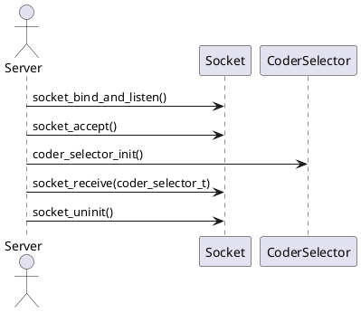
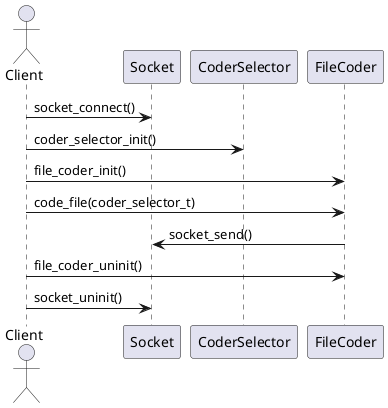

# TP1-Cryptosockets

## Diagrama de secuencia: Servidor recibe mensaje de cliente.

```plantuml
@startuml
    actor Server
    Server -> Socket : socket_bind_and_listen()
    Server -> Socket : socket_accept()
    Server -> CoderSelector : coder_selector_init()
    Server -> Socket : socket_receive(coder_selector_t)
    Server -> Socket : socket_uninit()
    
@enduml
```
## Diagrama de secuencia: Cliente envia mensaje a servidor.

```plantuml
@startuml
    actor Client
    Client -> Socket : socket_connect()
    Client -> CoderSelector : coder_selector_init()
    Client -> FileCoder : file_coder_init()
    Client -> FileCoder: code_file(coder_selector_t)
    FileCoder -> Socket : socket_send()
    Client -> FileCoder : file_coder_uninit()
    Client -> Socket : socket_uninit()
    
@enduml
```
