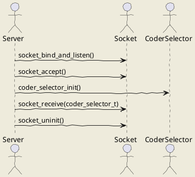

# TP1-Cryptosockets

## Diagrama de secuencia: Servidor recibe mensaje de cliente.


```plantuml
@startuml
    skinparam backgroundColor #EEEBDC
    skinparam handwritten true
    actor Server
    actor Socket
    Server -> Socket : socket_bind_and_listen()
    Server -> Socket : socket_accept()
    actor CoderSelector
    Server -> CoderSelector : coder_selector_init()
    Server -> Socket : socket_receive(coder_selector_t)
    Server -> Socket : socket_uninit()
    
@enduml
```

<div hidden>
```
@startuml firstDiagram

Alice -> Bob: Hello
Bob -> Alice: Hi!
		
@enduml
```
</div>

