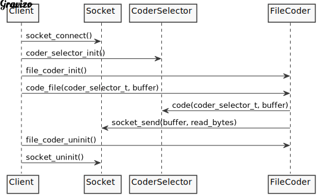

# TP1-Cryptosockets
# Alumna: Azul Zaietz
# Padrón: 102214

En este trabajo se implementa un programa que actúa por un lado como cliente y por el otro como servidor. El rol del cliente es el de leer un archivo y enviarlo cifrado al servidor con el método especificado. El servidor recibe el mensaje y lo decodifica.

El siguiente informe detalla información relevante del proceso de desarrollo del programa: su esqueleto, diagramas de flujo y soluciones a algunos problemas presentados.

# DISEÑO

Antes de implementar la solución, se empezó por diseñarla, planteando las diferentes estructuras del programa y cómo iban a relacionarse entre sí. 

El diseño se pensó usando como base la programación orientada a objetos.

En un principio se plantearon los siguientes:

- METODOS DE CIFRADO: era necesario crear un TDA por cada método de cifrado con atributo "key" y métodos "code()" y "decode()". 
Debían implementarse independientemente entre sí y del resto de los objetos del programa. Esta abstracción permite que puedan usarse para cifrar y descifrar cualquier mensaje que sea pasado por los mismos.

- SOCKET: un TDA socket con los métodos necesarios para poder efectuar la comunicación entre cliente y servidor: abrir el socket, esperar a una conexión, aceptarla, enviar y recibir mensajes a través del mismo, y finalmente cerrar el socket correctamente.

- SERVIDOR: TDA que use a los mencionados anteriormente para cumplir su función: abrir un socket, esperar a recibir un mensaje, descifrarlo y mostrarlo.

- CLIENTE: al igual que el servidor, debía ser un TDA que utilice al socket y a los métodos de cifrado para enviar un mensaje cifrado al servidor.

- FILE CODER: para delegar responsabilidad, se pensó este TDA con la función de leer un archivo y cifrarlo. Va a ser usado por el cliente cuando corresponda.

# IMPLEMENTACIÓN

El primer problema que surgió a la hora de implementar el diseño pensado fue la falta de polimorfismo en C. Idealmente en programación orientada a objetos, todos los cifradores iban a tener un método "code()" y otro "decode()" que iban a poder usarse siempre y automáticamente el programa iba a darse cuenta de qué cifrador se trataba debido a que iba a poder saber qué objeto era. 
La solución que se planteó fue crear un nuevo TDA llamado CODER SELECTOR, cuya función era reconocer de qué tipo de dato se trataba y usar los métodos correspondientes en cada caso. 

Otras solución que surgió durante de la implementación fue la necesidad de el uso de una función común para poder parsear los parámetros leídos de la línea de comandos de la terminal, para que pueda ser usada tanto por el servidor como por el cliente.

## Diagrama de secuencia: Servidor recibe mensaje de cliente.

## Diagrama de secuencia: Cliente envia mensaje a servidor.

# Diagrama de clases representativo de la solución final:

